# The Mom Care

# Project Overview

## Introduction
The Mom Care has expanded with the launch of a new digital platform dedicated to pregnancy
care.
The name has a strong brand recognition and appears to have a significant presence for mothers and their babies.

## Problem Statement
There is a tradition surrounding in Pregnancy and Postpartum healing practices. Many women find it difficult to workout due to
misconceptions, lack of knowledge about workout benefit to mother and child for not finding suitable and safe workouts and diet to rely on.
How can we help women achieve pre and post-natal fitness?

## Potential Solution
* Personalized exercises and diet
* Provide reminders
* Regular Health status
* Provide women with a sense of motivation to take up general fitness routines.
* Easy and guided meditation to help anxiety and stress.
* Attend live pre & post-natal classes and couple sessions.
* Support Community

## Goal
Make an app that is easy for mother as well as relatives to understand the use of pregnancy fitness.

## Target Audience
Parents in their 25 to 45 range.
Relatives from any age group.

## Screenshots

### OnBoarding Screens
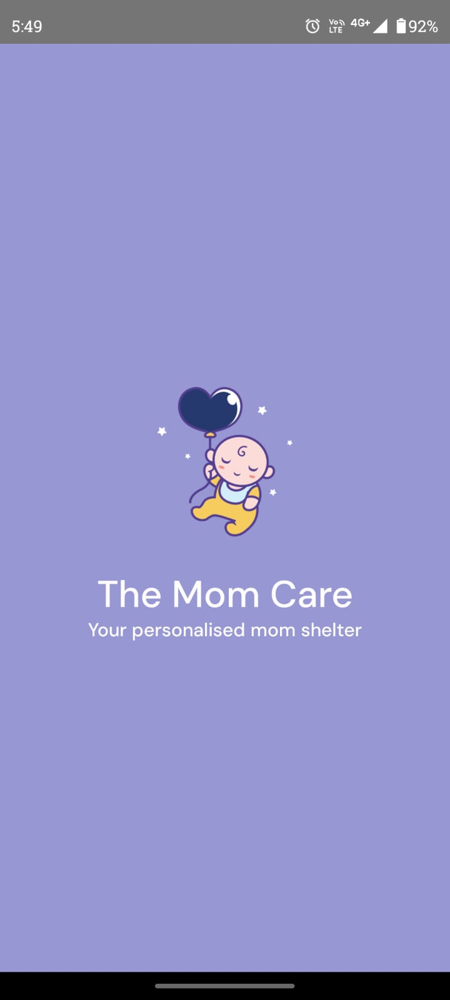 &nbsp;&nbsp;&nbsp;&nbsp; 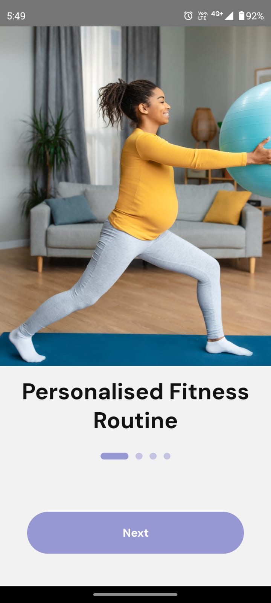 &nbsp;&nbsp;&nbsp;&nbsp; 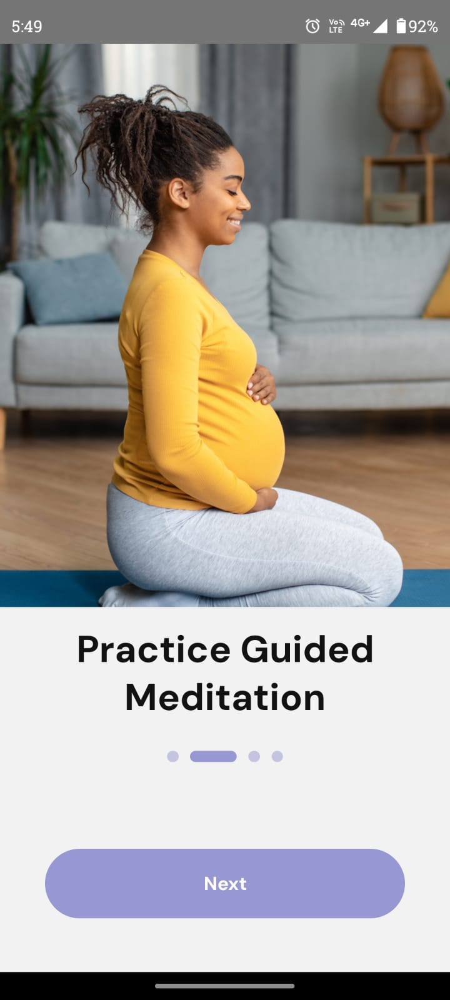 &nbsp;&nbsp;&nbsp;&nbsp;  &nbsp;&nbsp;&nbsp;&nbsp; 

### Register Screens
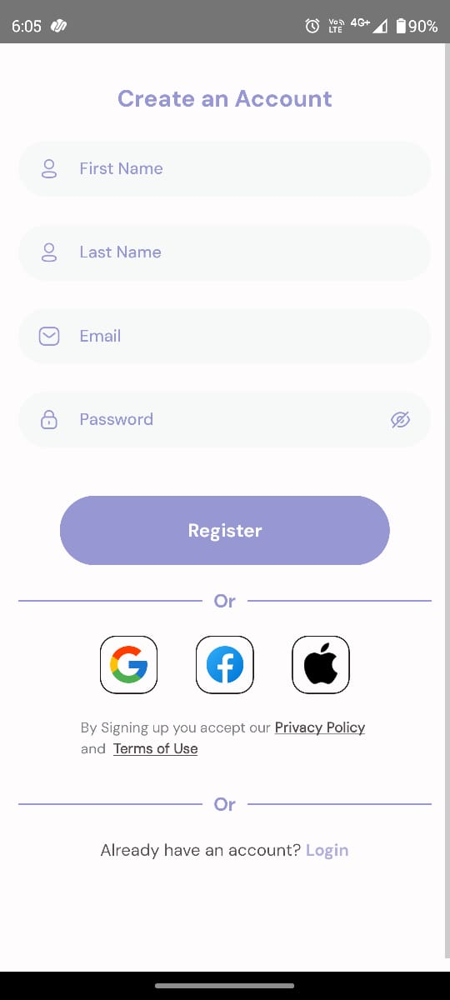 &nbsp;&nbsp;&nbsp;&nbsp; 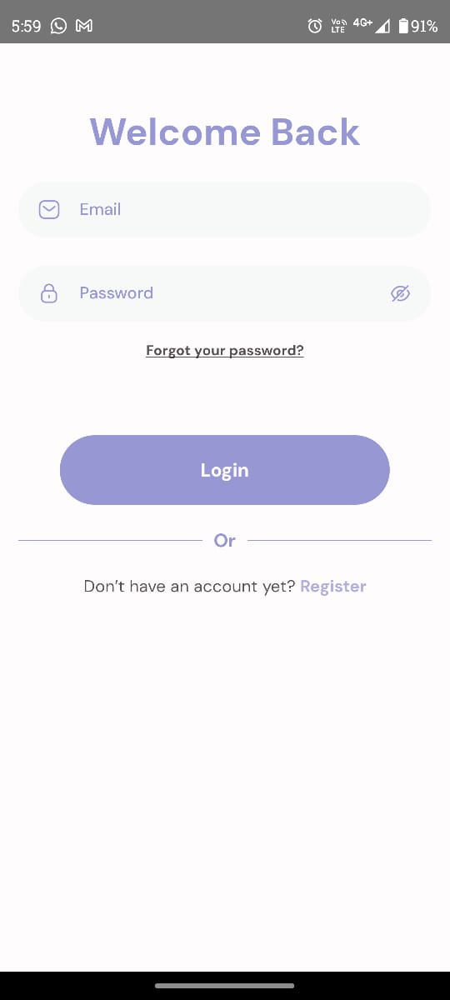 &nbsp;&nbsp;&nbsp;&nbsp;  &nbsp;&nbsp;&nbsp;&nbsp; 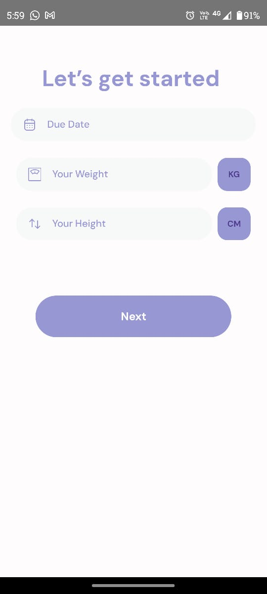 &nbsp;&nbsp;&nbsp;&nbsp; 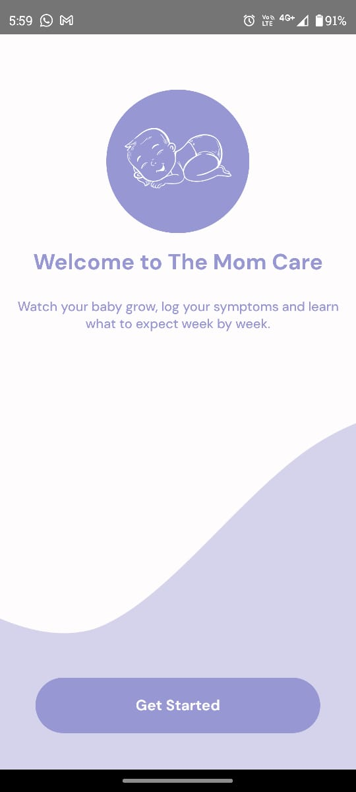 &nbsp;&nbsp;&nbsp;&nbsp; 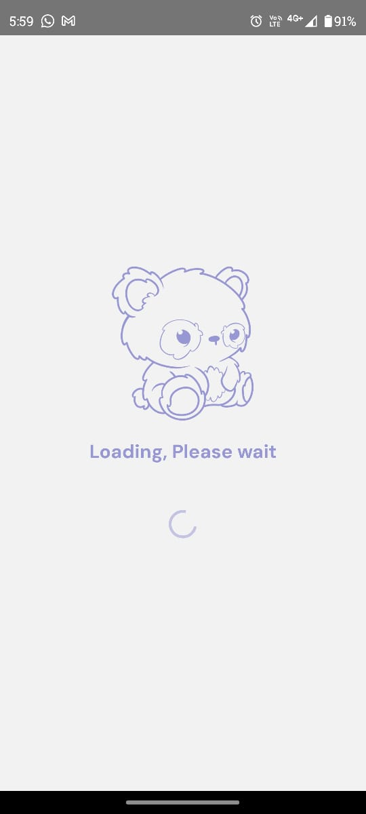

### Home Screen
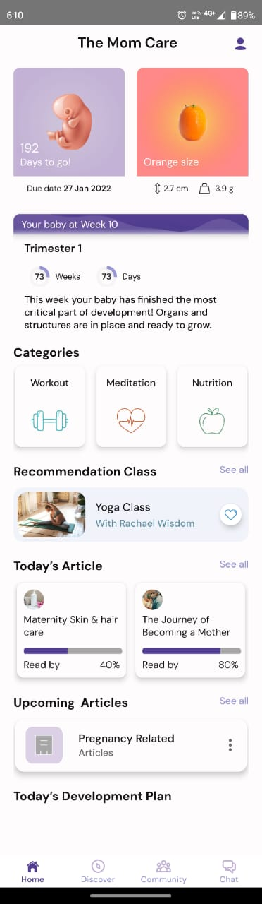

### Workout Screens
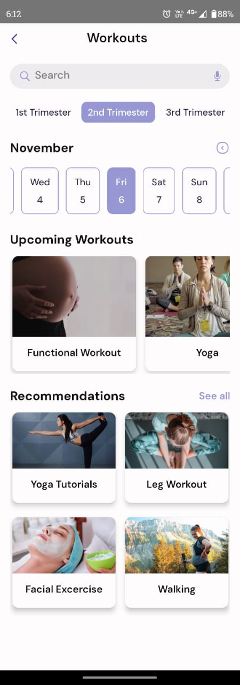 &nbsp;&nbsp;&nbsp;&nbsp; 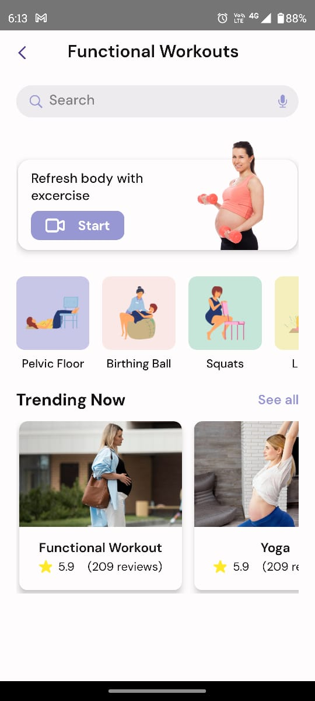

### Meditation Screens
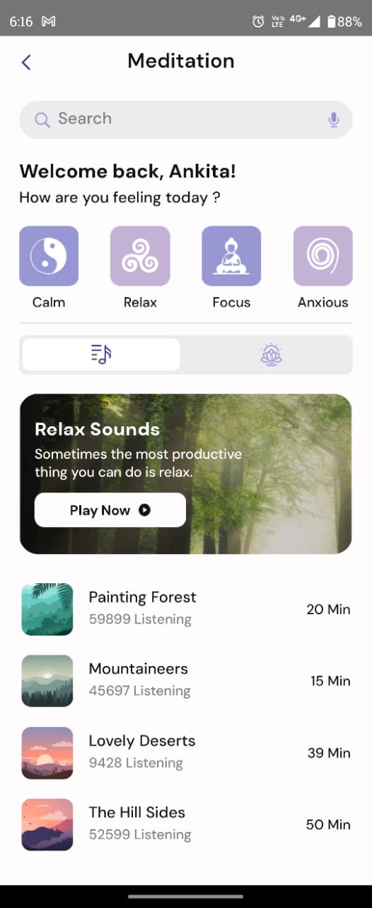 &nbsp;&nbsp;&nbsp;&nbsp; 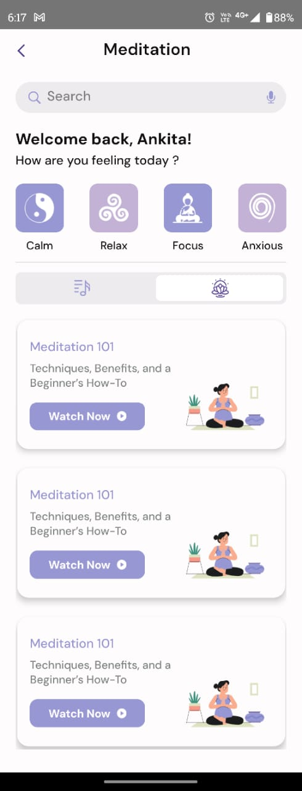 &nbsp;&nbsp;&nbsp;&nbsp; 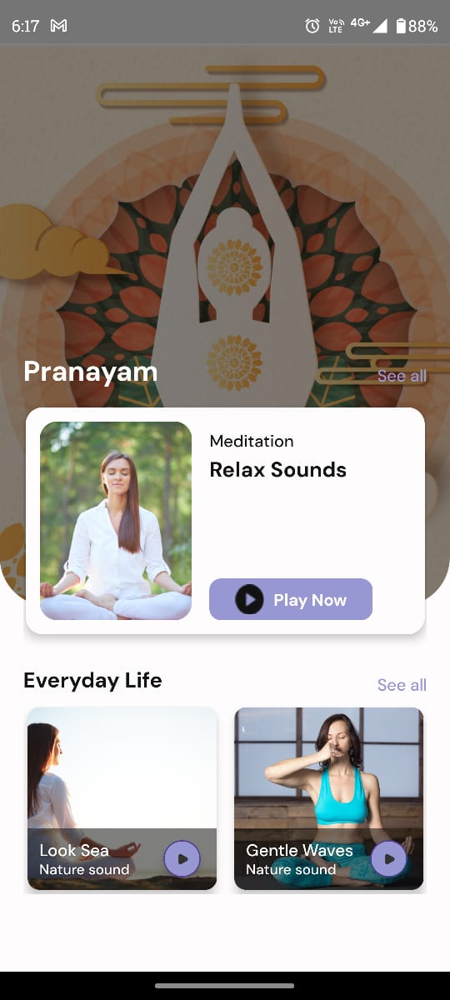 &nbsp;&nbsp;&nbsp;&nbsp; 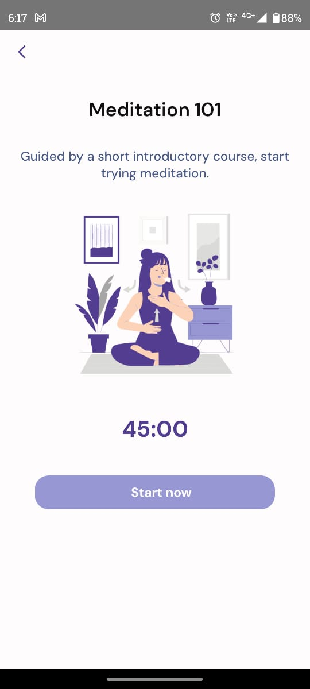

### Nutrition Screens
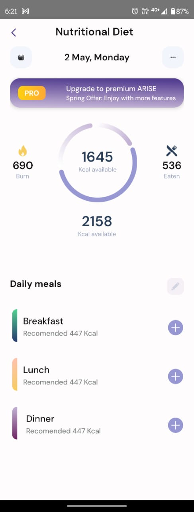 &nbsp;&nbsp;&nbsp;&nbsp; 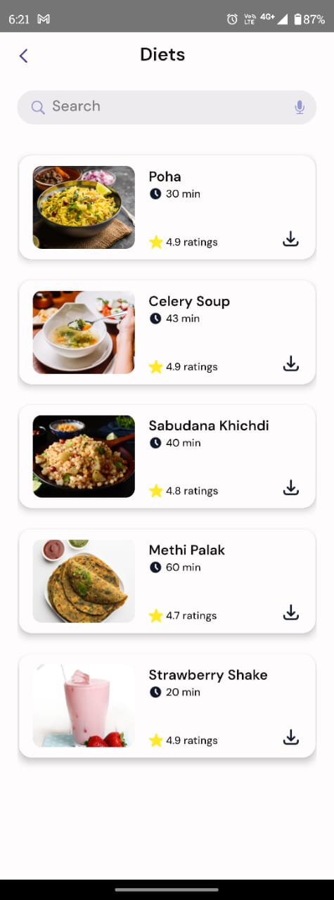 &nbsp;&nbsp;&nbsp;&nbsp; 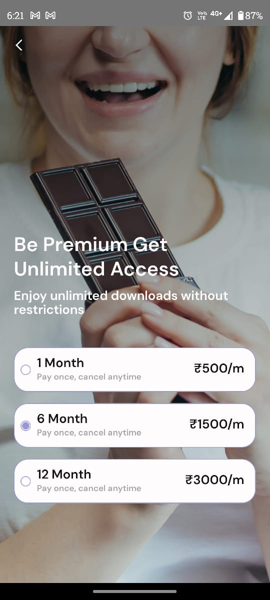
